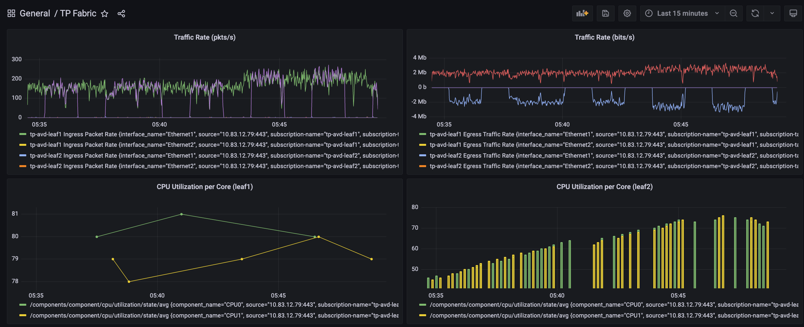

# cgig

`cgig` stack aka CVP + GNMIC + InfluxDB + Grafana

This is a proof-of-concept demo with Arista CloudVision as the network-wide OpenConfig database and [gNMIc](https://gnmic.kmrd.dev/) deployment model where gNMIc acts as a collector
that subscribes to Arista EOS telemetry states stored centrally in CloudVision and outputting that into InfluxDB, which then can be plotted in Grafana.

Prerequisites:

- unix-based OS with docker installed
- CloudVision 2021.2.0 (recommended 2022.1.0+)
- TerminAttr 1.13.1+ (latest is always the greatest) and having `-cvgnmi` flag set
e.g.:

```shell
daemon TerminAttr
   exec /usr/bin/TerminAttr -cvaddr=192.0.2.100:9910 -taillogs -cvauth=token,/tmp/token -smashexcludes=ale,flexCounter,hardware,kni,pulse,strata -ingestexclude=/Sysdb/cell/1/agent,/Sysdb/cell/2/agent -cvvrf=management -cvgnmi
   no shutdown
```

- the EOS devices must have gNMI running
e.g.:

```shell
management api gnmi
   transport grpc MGMT
     vrf MGMT
   provider eos-native
```

Tested on macOS Monterey.

## Steps

1\. Clone the repository and update the [gnmic1.yaml](./gnmic1.yaml)

2\. Run `docker-compose up -d` to build the containers

3\. Verify the containers are up

```shell
docker ps

CONTAINER ID   IMAGE                              COMMAND                  CREATED          STATUS          PORTS                                            NAMES
ccf6bc577bf9   ghcr.io/karimra/gnmic:latest       "/app/gnmic subscrib…"   12 minutes ago   Up 12 minutes                                                    gnmic1
d1798d9209e7   grafana/grafana:8.2.6              "/run.sh"                12 minutes ago   Up 12 minutes   0.0.0.0:3001->3000/tcp                           grafana
8a9da97e33a5   quay.io/influxdb/influxdb:v2.0.4   "/entrypoint.sh infl…"   12 minutes ago   Up 12 minutes   0.0.0.0:8086->8086/tcp, 0.0.0.0:9999->9999/tcp   influxdb
```

4\. Access grafana at http://localhost:3001 and check if the graphs are automatically loaded. You should see



## Example flux queries

CPU Utilization per Core

```text
from(bucket: "telemetry")
  |> range(start: v.timeRangeStart, stop: v.timeRangeStop)
  |> filter(fn: (r) => r["_measurement"] == "tp-avd-leaf2")
  |> filter(fn: (r) => r["_field"] == "/components/component/state/memory/utilized" or r["_field"] == "/components/component/cpu/utilization/state/avg")
  |> filter(fn: (r) => r["component_name"] == "CPU0" or r["component_name"] == "CPU1")
  |> aggregateWindow(every: v.windowPeriod, fn: mean, createEmpty: false)
  |> yield(name: "mean")
```

RX Traffic rate (bits/s)

```text
from(bucket: "telemetry")
  |> range(start: v.timeRangeStart, stop: v.timeRangeStop)
  |> filter(fn: (r) => r["_measurement"] == "tp-avd-leaf1" or r["_measurement"] == "tp-avd-leaf2")
  |> filter(fn: (r) => r["_field"] == "/interfaces/interface/state/counters/in-octets")
  |> filter(fn: (r) => r["interface_name"] == "Ethernet1" or r["interface_name"] == "Ethernet2")
  |> aggregateWindow(every: v.windowPeriod, fn: mean, createEmpty: false)
  |> sort(columns: ["_time"], desc: false)
  |> derivative(unit: 1s, nonNegative: true, columns: ["_value"], timeColumn: "_time")
  |> map(fn: (r) => ({ r with _field: "Ingress Traffic Rate" }))
  |> map(fn: (r) => ({ r with _value: r._value * 8.0 }))
  |> drop(columns: ["_start", "_stop"])
```

Highly recommend using the Query Builder from the InfluxDB UI at http://localhost:8086.

## Useful links

[flux](https://docs.influxdata.com/influxdb/cloud/query-data/flux/)

[influxdb-templates](https://www.influxdata.com/influxdb-templates/network-interface-performance-monitor/)

Checkout [cvp-to-influx](https://github.com/arista-netdevops-community/cvp-to-influx) app written by [Dan Hertzberg](https://github.com/burnyd), a GO app that automatically subscribes to all
devices streaming OpenConfig data into CloudVision.
